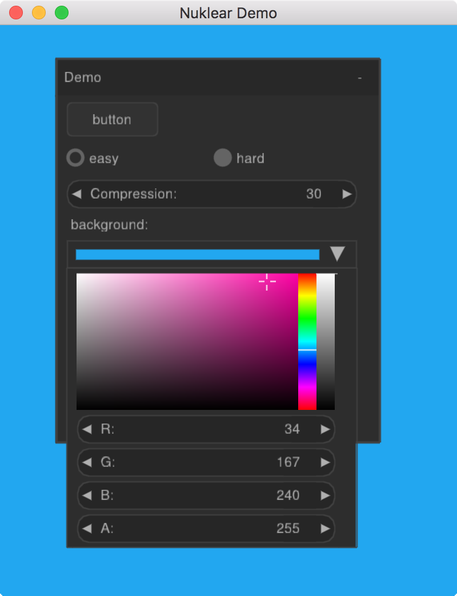

## Nuklear [](/CHANGELOG.txt) [](https://godoc.org/github.com/golang-ui/nuklear/nk)

Package nk provides Go bindings for nuklear.h — a small ANSI C gui library. See [github.com/vurtun/nuklear](https://github.com/vurtun/nuklear).<br />
All the binding code has automatically been generated with rules defined in [nk.yml](/nk.yml).

There is no idiomatic wrapper package that will make things easier to use, but the original API is pretty straightforward. The `nk` package is fine for the start, then we'll figure out something better that just a wrapper.

### Features (plain C version)

* Immediate mode graphical user interface toolkit
* Single header library
* Written in C89 (ANSI C)
* Small codebase (~15kLOC)
* Focus on portability, efficiency and simplicity
* No dependencies (not even the standard library if not wanted)
* Fully skinnable and customizable
* Low memory footprint with total memory control if needed or wanted
* UTF-8 support
* No global or hidden state
* Customizable library modules (you can compile and use only what you need)
* Optional font baker and vertex buffer output

#### About nuklear.h

This is a minimal state immediate mode graphical user interface single header
toolkit written in ANSI C and licensed under public domain.
It was designed as a simple embeddable user interface for application and does
not have any dependencies, a default render backend or OS window and input handling
but instead provides a very modular library approach by using simple input state
for input and draw commands describing primitive shapes as output.
So instead of providing a layered library that tries to abstract over a number
of platform and render backends it only focuses on the actual UI.

### Overview


Your Go application runs a loop where it handles input from the platform and manages the rendering backend. It uses Nuklear API bindings (the `nk` package) to run UI commands for layout and event handling. Nuklear maintains a draw command list that is consumed by one of the rendering backends so the UI is displayed. In this case, a C program is being a middleman that does all the UI heavylifting for us, so we can focus on the application logic, event handling and drawing backends in Go.

### Installation of nk

Supported platforms are:

* Windows 32-bit
* Windows 64-bit
* OS X
* Linux
* Android

The desktop support is achieved using [GLFW](https://github.com/go-gl/glfw) and there are backends written in Go for OpenGL 2.1 and OpenGL 3.2. Thanks to [strangebroadcasts](https://github.com/strangebroadcasts) it also has [SDL2](https://github.com/veandco/go-sdl2) support now.

Android support is added using the [android-go](http://github.com/xlab/android-go) project, there is a corresponding backend for OpenGL ES 2.0 or 3.0 surface and input handling logic. Sophisticated things like scroll gestures will be added later.

#### Desktop installation

Debian/Ubuntu dependencies: (Header files required for GLFW)

```
# apt install xorg-dev
```

Fedora(tested on 28):

```
# libX11-devel libXcursor-devel libXrandr-devel libXinerama-devel mesa-libGL-devel libXi-devel
```


After that, standard `go get` should work:

```
$ go get github.com/golang-ui/nuklear/nk
```

On desktop both OpenGL 2.1 and OpenGL 3.2 contexts are working fine, but by default OpenGL 3.2-core is used, to compile with OpenGL 2.1 support instead. The 2.1 backend is for legacy hardware or VMs like Parallels.

```
$ go get -tags opengl2 github.com/golang-ui/nuklear/nk
```

Additional steps for Windows users:

1. Get MinGW compiler toolchain and MSYS via [MinGW installer](https://sourceforge.net/projects/mingw/files/latest/download);
2. Open MSYS shell (usually `C:\MinGW\msys\1.0\msys.bat`);

Then everything should go smooth.

```
$ go version
go version go1.6.2 windows/386

$ gcc -v
COLLECT_GCC=C:\MinGW\bin\gcc.exe
Thread model: posix
gcc version 5.3.0 (GCC)

$ go install github.com/golang-ui/nuklear/nk
```

Hint: use `-tags sdl2` to run with SDL2 instead of GLFW. SDL2 requires additional installation process, see [SDL2](https://github.com/veandco/go-sdl2). Use GLFW if you want to stay go-get-able.

### Android demo

In order run Android demo app [nk-android](https://github.com/golang-ui/nuklear/blob/master/cmd/nk-android/main.go) make sure that you've prepared your environent as described in plain [example](https://github.com/xlab/android-go/tree/master/example) Android app. Namely you need to install Android SDK, tools and run `make toolchain`:

```bash
$ cd $GOPATH/src/github.com/golang-ui/nuklear/cmd/nk-android
$ make toolchain # need to run once

# the regular routine:
$ make
$ make install
$ make listen
```

&nbsp;&nbsp;

[Click for video](https://www.youtube.com/watch?v=3-MiceegZlM)

### Desktop demo

There is an example app [nk-example](https://github.com/golang-ui/nuklear/blob/master/cmd/nk-example/main.go) that shows the usage of Nuklear GUI library, based on the official demos.

```bash
$ go get github.com/golang-ui/nuklear/cmd/nk-example

$ nk-example
2016/09/23 23:13:09 glfw: created window 400x500
2016/09/23 23:13:10 [INFO] button pressed!
2016/09/23 23:13:10 [INFO] button pressed!
2016/09/23 23:13:10 [INFO] button pressed!
```



Another more realistic Go application that uses Nuklear to do its GUI, [a simple WebM player](https://github.com/xlab/libvpx-go):

<a href="https://www.youtube.com/watch?v=5kj5ApnhPAE"></a>

### Rebuilding the package

You will need to get the [c-for-go](https://git.io/c-for-go) tool installed first.

```
$ git clone https://github.com/golang-ui/nuklear && cd nuklear
$ make clean
$ make
```

### License

All the code except when stated otherwise is licensed under the [MIT license](https://xlab.mit-license.org).
Nuklear (ANSI C version) is in public domain, authored from 2015-2016 by Micha Mettke.
